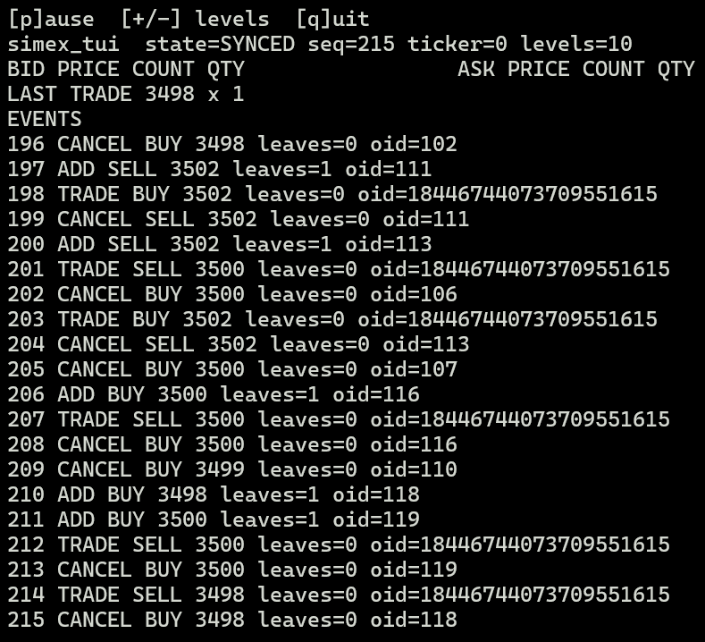

# simex

simex (SIMulated EXchange) is a SHFE-style C++ trading exchange, with simulated market participant order flows and a TUI to monitor changes to the order book.



## Quick Start

### Prerequisites

- A C++20 compiler (GCC or Clang)
- CMake 3.25+ and Ninja
- OpenSSL (Crypto)
- nlohmann_json, or opt into the pinned source fallback with `SIMEX_FETCH_NLOHMANN_JSON=ON`

### Building with CMake

For reproducible Ninja builds, use the checked-in CMake presets:

```sh
cmake --preset ci-gcc
cmake --build --preset ci-gcc
ctest --preset test-ci-gcc
```

The `dev-gcc`, `dev-clang`, `ci-gcc`, `ci-clang`, and `sanitizer` presets provide the corresponding local, CI, and sanitizer configurations.

Without presets:

```sh
cmake -S . -B build -DSIMEX_FETCH_NLOHMANN_JSON=ON
cmake --build build
ctest --test-dir build --output-on-failure
```

Run the deterministic demo with:

```sh
./build/ci-gcc/simex_demo simex.json
```

## Note

The exchange could run alongside my market-participant-side trading system [jev-qaunt](https://github.com/itsadrianxv/jev-quant) to form a complete trading ecosystem. Check out [the transport service guide](docs/jev-transport-service.md) for more detail.

I am very, very early in this project. Expect bugs.

## License

MIT
